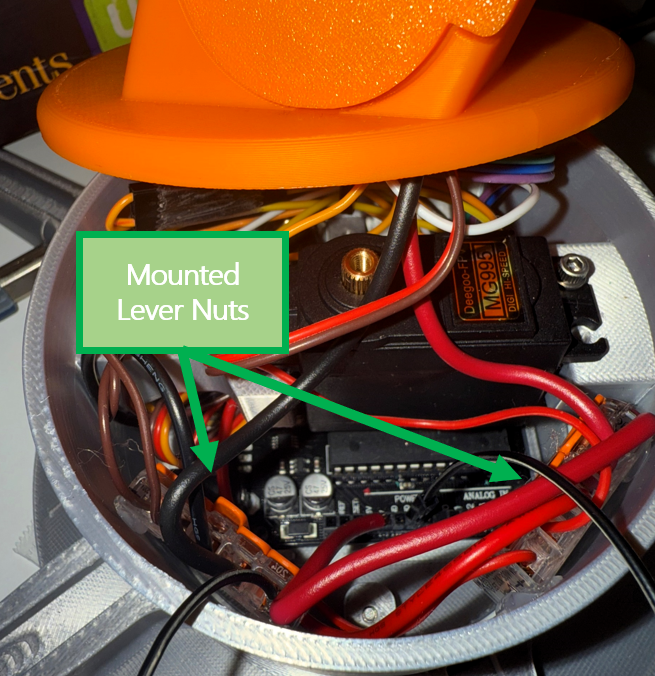
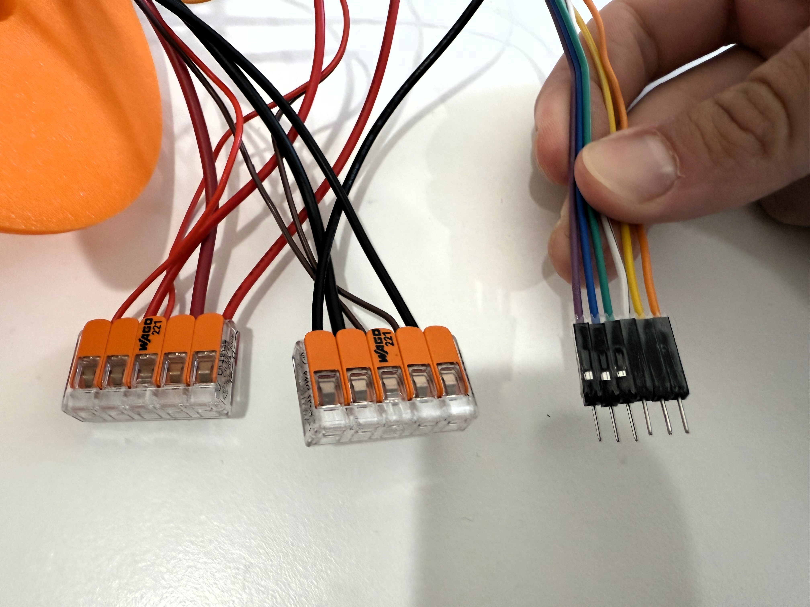
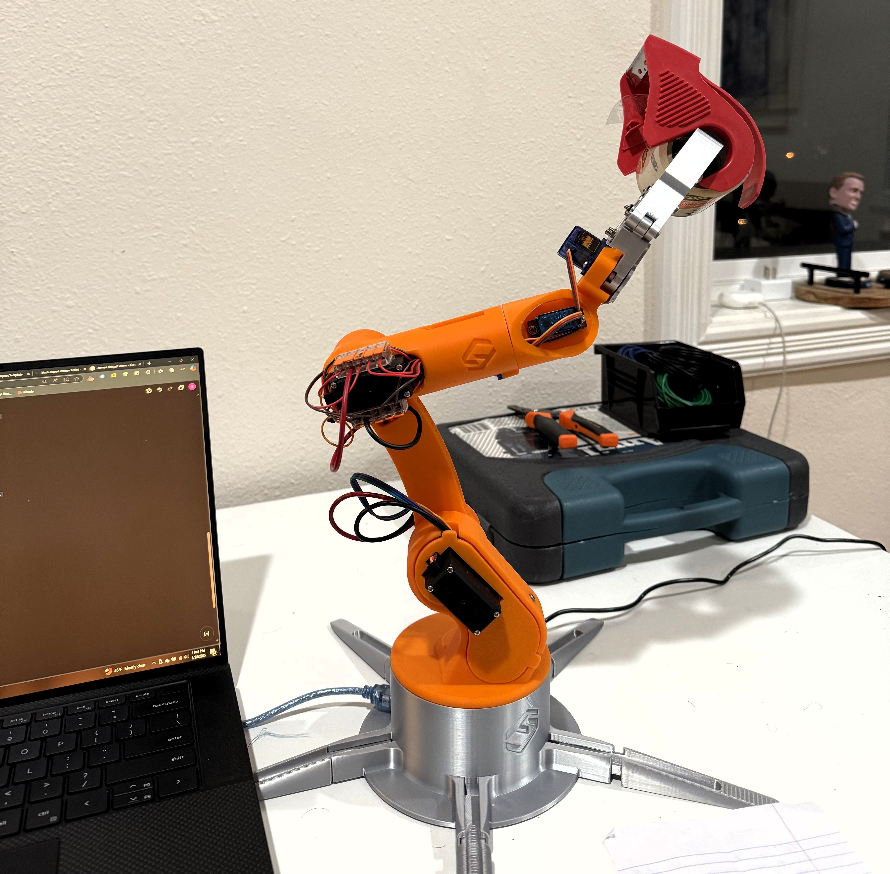

# Desk Cleaning Robot Arm: Hand-Gelina Jolie

A 6-axis robot arm, built for under $100 using 3D printed parts and an Arduino, automates desk tidying while exploring core robotics principles.

This post chronicles my adventure in building a 6-axis robotic arm, primarily for the noble cause of keeping my desk tidy. If you've ever dreamt of automating your clutter, this guide will walk you through how you can achieve a similar feat for **less than $100**. Her name is *Hand-Gelina Jolie.*

My dive into this particular "rabbit hole" served a dual purpose: to introduce myself to the fascinating world of robotics and to significantly hone my mechanical problem-solving intuition. These personal objectives directly informed the project's requirements. In an effort to keep the project accessible and timely, I opted against using CAD software, instead leveraging open-source solid models from an online creator, reserving my efforts for the hands-on challenges of assembly, wiring, and programming.

Within this report, you'll find a detailed Bill of Materials for all necessary components. I'll openly discuss some of my trials and tribulations, particularly when it came to wiring (and believe me, there were a few!). I'll also share practical advice gleaned from those experiences. Finally, I'll provide my Arduino scripts, which facilitated everything from initial tests and calibration to a hard-coded final demo performing a delightful pick-and-place task: retrieving a roll of solder wire from my desk and diligently storing it on a shelf.

*Figure 1: Click to watch the full demo video on Twitter/X*

---

## Table of Contents
* [System Requirements](#system-requirements)
* [Bill of Materials (BOM)](#bill-of-materials-bom)
* [Mechanical Design & Printing](#mechanical-design--printing)
    * [Assembly](#assembly)
    * [Component Assembly](#component-assembly)
    * [Cable Management](#cable-management)
* [Electronics](#electronics)
* [Software Control](#software-control)
    * [Individual Motor Test (V2)](#individual-motor-test-v2)
    * [Multiple Motor Test (V3)](#multiple-motor-test-v3)
    * [Automated Pick-and-Place Demo (V5)](#automated-pick-and-place-demo-v5)
* [Key Challenges & Lessons Learned](#key-challenges--lessons-learned)
    * [Wiring Management](#wiring-management)
    * [SG90 Servo Limitations](#sg90-servo-limitations)
    * [Power Supply Current Rating](#power-supply-current-rating)
    * [Hard-coding Positions](#hard-coding-positions)
* [Future Improvements](#future-improvements)

---

## **System Requirements**

This project was developed with the following key requirements in mind:

1.  **Functionality:** The robotic arm must be capable of picking up an object from my desk and storing it away in a drawer.
2.  **Assembly Constraint:** No soldering was allowed in the assembly of the electrical components (in an attempt to keep assembly straightforward and accessible to all).
3.  **CAD Software:** No CAD software was to be used (in an effort to keep the project accessible and timely).
4.  **Timeline:** The entire system needed to be completed within two months, working in my free time.
5.  **Cost-Effectiveness:** The total cost of all components for the system was to be less than $100.

## **Bill of Materials (BOM)**

The following key components were utilized in the construction of the robotic arm. A detailed BOM, including specific links to parts (mostly sourced from Amazon for convenience), can be found in the project files as an Excel sheet named `Hand-Gelina Jolie BOM.xlsx`.

Below is some of my rationale in selecting critical components:

* **MG995 Servos (Quantity: 3)**
    * **Rationale:** The joints closest to the arm's base are subjected to the highest torque demands, as they must support the entire levered mass of the arm and payload. For these critical positions, I selected MG995 motors, each capable of supplying approximately 11.25 lb-in of torque. These servos are commonly available, inexpensive, and benefit from extensive online documentation, which was helpful for troubleshooting.

* **SG90 Servos (Quantity: 3)**
    * **Rationale:** For the three joints further up the arm (closer to the end-effector), I opted for SG90 servos. Similar to the MG995s, these are very common in the hobby robotics space and are well-documented. The only **kicker** was their significantly lower torque output, providing only about 1.04 lb-in each. This limitation heavily influenced later design decisions and performance.

* **5V, 3A Power Supply Adapter with 2.1mm Jack (Quantity: 1)**
    * **Voltage Rating:** Chosen for compatibility with both the Arduino Uno and the specified servo motors.
    * **Current Rating (Initial Rationale):** My initial selection was based on a nominal current draw calculation:
        * Each SG90 motor draws about 0.550 Amps.
        * Each MG995 servo draws about 0.3A.
        * Calculated maximum nominal current draw: $3 \times (0.550 \text{ A}) + 3 \times (0.30 \text{ A}) = 2.55 \text{ Amps}$.
        * Thus, a 3A power supply was selected to provide some safety factor and capitalize on its wide availability.
    * **Note:** This rationale, however, was slightly flawed as it primarily considered nominal power draw rather than peak power draw, especially during high-load movements. This oversight occasionally resulted in suboptimal robot performance, a point I will elaborate on in the [Key Challenges & Lessons Learned](#key-challenges--lessons-learned) section.

* **2.1mm DC Jack Female (Quantity: 1)**
    * **Rationale:** Chosen for its widespread compatibility and ease of incorporation into the system, matching the power supply's jack.
      
## **Mechanical Design & Printing**

My goal wasn't to develop CAD expertise; instead, I leveraged open-source solid models from an online creator, reserving my efforts for the hands-on challenges of assembly, wiring, and programming. Accordingly, the solid models for the robotic arm structure and the circuit diagrams were sourced from a tutorial by a Peruvian YouTuber. You can find the models [here]([URL](https://cults3d.com/en/3d-model/gadget/brazo-robotico-con-arduino-step-files-robotic-arm-guardar-reproducir-export)).

These models were then 3D printed using PLA filament on my Bambu P1S printer. I printed all components with a 15% infill. The printing process was relatively smooth, with no significant issues encountered. The total print time was approximately 17 hours, requiring two separate runs as all the parts could not fit on a single print bed.

*Figure 2: All components needed for the robot.*

### **Assembly**

#### **Component Assembly:**
I used the solid model assembly in CREO Parametric, as shown in **Figure 3**, to serve as my guide when assembling each printed component. Each joint was mated using a servo adapter plate and fasteners which came with the servos. It was crucial to pay close attention during this phase to avoid mounting moving components too closely and thereby introducing friction. To optimize the assembly and maintain nominal clearances, I heavily relied on the V2 control script to test motor movements, ultimately minimizing friction for the motors to overcome.

*Figure 3: 3D Model of Hand-Gelina Jolie in CREO Parametric. This assembly was used to aid in assembly.*

#### **Cable Management:**
This phase presented significant trial and error due to unforeseen challenges with wiring, particularly given the "no soldering" requirement. This constraint often necessitated creative and sometimes bulky connection methods. While I'll elaborate further in the [Key Challenges & Lessons Learned](#key-challenges--lessons-learned) section, my recommendations for future projects include: keeping cable runs as short as possible, utilizing thinner gauge wires for all signal connections (reserving thicker wires for power), and securing lever nuts in place with hot glue to prevent disconnections.

Specifically, I mounted two 5-way lever nuts at the elbow, as shown in **Figure 4**, to relay power to the upper motors. 

*Figure 4: Lever Nuts used to organize cables and consolidate the number of power lines running up the arm.*

Additionally, two more 5-way lever nuts were mounted in the base, as seen in **Figure 5**, to distribute power to the remaining motors and transmit it up to the elbow's lever nuts. 

*Figure 5: Lever Nuts hot glued into the base for positive and ground runs. This helped save space in the packed base.*

To further enhance connector rigidity, improve overall cable management, and simplify assembly, I utilized clear Scotch tape to create organized bundles of Dupont wires, as illustrated in **Figure 6**.

*Figure 6: DuPont Cable bundles made with scotch tape saved space and made assembly much easier.*

## **Electronics**

An Arduino Uno serves as the central controller for the entire robotic arm. Its built-in motor control pins were particularly advantageous, simplifying the organization and writing of the control code detailed in a later section. The circuit design itself is straightforward, primarily relying on the Arduino to relay power from the external power supply to the individual motors.

*Figure 7: Simple circuit utilizing the motor pins of the Arduino Uno. Source: [FabriCreator]([URL]([https://cults3d.com/en/3d-model/gadget/brazo-robotico-con-arduino-step-files-robotic-arm-guardar-reproducir-export)](https://fabricreator.com/)).*

## **Software Control** 

The following scripts were developed to test individual components and execute the robotic arm's demonstrations. Each motor is attached to its corresponding control pin on the Arduino Uno, as labeled in **Figure 7 and 8**.

*Figure 8: Motor numbering convention used for the scripting below.*

### **Individual Motor Test (V2)**
This initial script provided a fundamental interface for controlling individual servos directly via the Arduino's serial monitor. Users could select a specific servo (e.g., `S2`) and then input a desired angle (e.g., `120`) to command its movement. A `SPEED=XX` command also allowed for adjusting the movement velocity by setting a delay between each degree increment.

While it might seem like an over-engineered approach, this script was invaluable for validating the assembly process step-by-step. It allowed me to rigorously test motor movements during construction, ensuring I did not introduce additional friction into the system by meticulously maintaining small, nominal clearances. Knowing the motors would already be operating at or near their torque limits, this extra caution to avoid any superfluous resistance was considered a worthwhile investment of time.

### **Multiple Motor Test (V3)**
This script marked the beginning of hard-coding specific positions for the robot, allowing for the simultaneous movement of all motors to predefined configurations. By sending a command such as `POS=1` via the serial monitor, all servos would synchronously transition to a stored arm configuration. This functionality proved invaluable for rapidly testing various arm poses and laid essential groundwork for developing more complex, automated sequences.

Through testing with this script, I identified that certain motions excessively strained the weaker motors. Consequently, in the final code, I incorporated additional intermediate steps designed to bring the manipulated mass closer to the robot's base. This maneuver effectively reduces the lever arm extending from the held mass, thereby significantly decreasing the load on the motors.

### **Automated Pick-and-Place Demo (V5)**
The final iterations, V4 and V5, truly brought the arm's functionality to life with a full pick-and-place demonstration. A sequence of 15 meticulously hard-coded positions (from `pos0` to `pos14`) was crafted specifically to perform the task of picking up a solder roll and placing it on a shelf. The `go` command initiates this entire automated sequence, while the `no` command provides an essential emergency stop functionality. V5 further refined the demo by incorporating strategic pauses between movements, allowing for more natural and stable operation (for example, pauses after gripping and releasing an object).

#### **Pick-and-Place Sequence Breakdown (V5 Positions):**

* **`pos0` (Homing Position):** The arm stands straight, serving as a reset or starting point.
* **`pos1`:** Arm bends down and positions the gripper directly over the solder spool.
* **`pos2`:** The gripper closes, securing the solder spool. (Followed by a 2-second pause for grip stability).
* **`pos3` - `pos5`:** The arm pulls the grasped solder spool/mass closer to the base. This was a critical adjustment to mitigate strain on the weaker end-effecter servos (SG90s) by shifting the load closer to the stronger MG995 servos at the arm's base.
* **`pos6`:** The arm rotates to orient itself towards the target shelf/drawer.
* **`pos7`:** The arm bends down, positioning the solder spool over the drawer.
* **`pos8`:** The gripper opens, releasing the solder spool into the drawer. (Followed by a 2-second pause to ensure the object has cleared).
* **`pos9` - `pos11`:** The gripper pulls up and away from the drawer, simultaneously rotating to clear the drawer opening and prepare for closing it.
* **`pos12`:** The arm moves to close the drawer.
* **`pos13`:** The arm moves away from the newly closed drawer.
* **`pos14`:** The arm returns to its homing position (`pos0`).

## **Key Challenges & Lessons Learned**

This project, while successful in demonstrating functionality, presented several significant challenges that offered valuable learning experiences:

### **Wiring Management:**
This aspect presented a significant and unexpected source of trial and error. My initial oversight in failing to allocate sufficient internal space for cabling led to a chaotic tangle of wires, as shown in **Figure 9**. For starters, during my first assembly attempt, the sheer volume of disarrayed wires prevented proper mounting of the robot onto its base. To bring some semblance of order to this chaos, I resorted to using lever nuts, carefully cutting wires to length, securing connections with hot glue where possible, and creating organized DuPont wire bundles.

*Figure 9: Early revision of the cable management, which was too bulky to fit into the base and caused a multitude of problemn.*

Even with these initial mitigation efforts, I still had to exercise extreme caution when mounting the robot onto its base. The crowded wire cavity within the base meant that the first motor's mobility was severely limited (the robot could only cover approximately 120° of rotation). Beyond this range, it risked pulling the Dupont wires out of place.

A particularly memorable incident occurred when I accidentally over-rotated the robot, causing a Dupont wire to barely dislodge from the Arduino. This led to the Arduino repeatedly cycling on and off, with motors jittering uncontrollably. Unaware of the subtle issue, I spent over eight hours troubleshooting, diligently checking current and voltage differentials at every connection point. I even went down a capacitor "rabbit hole" for hours after a tip from Grok, and changed out my Arduino entirely, mistakenly believing I had damaged a pin. Finally, I realized the issue was a pin barely pulled out in one of my homemade harnesses, a direct result of the over-rotation. This forced all motors to draw power directly from the Arduino, triggering its auto-reset protection mechanism.

Reflecting on this experience, my primary recommendation would be to remove the "no soldering" requirement I initially imposed on myself. (I've since learned to solder, and it's surprisingly straightforward!). This would enable the creation of custom harnesses, significantly reduce wire redundancy, and eliminate the bulky lever nuts, thereby saving a considerable amount of space. Additionally, I would design a larger base for the robot and incorporate dedicated, larger channels for cable runs directly into the 3D printed components, ensuring greater wiring integrity and ease of assembly.

### **SG90 Servo Limitations:**
The SG90 servos, deployed in the arm's end-effector and wrist joint, proved to be significantly underpowered for reliably holding and manipulating even lightweight objects, such as a roll of solder, particularly when the arm was extended. This torque limitation necessitated a creative re-evaluation of the pick-and-place strategy, which led to the implementation of a "pulling the mass closer to the base" maneuver (positions `pos3` to `pos5`). This technique effectively shifted the load closer to the more robust MG995 servos located at the arm's lower joints.

Furthermore, relying on inexpensive SG90 servos with their inherent internal potentiometer-based position feedback resulted in suboptimal accuracy and repeatability. The arm frequently experienced positional drift of a few degrees after a series of movements, leading to missed targets and requiring frequent manual resets to the home position. This lack of precision was a significant source of trial and error during the process of hard-coding the arm's various operational positions.

Finally, consistently pushing the SG90s to their operational limits, even with the load mitigation strategies, caused them to overheat. This thermal stress led to sluggish responses and necessitated cooldown periods after sustained use, interrupting workflow.

Moving forward, for future robotic applications, I will likely invest in higher-quality motors, or at minimum, utilize motors of MG995 caliber or superior. Depending on the application's specific requirements, I would also prioritize incorporating a dedicated encoder or a more accurate form of positional feedback. Such enhancements would enable the development of more robust control loops and eliminate the need for frequent manual resets and cooldowns, significantly improving overall system performance and reliability.

### **Power Supply Current Rating:**
A crucial oversight in my initial power supply selection was considering nominal current draw instead of **stall currents**. If I had accounted for these, the calculations would have been significantly different:

* Manufacturer specifications indicate the SG90 stall current to be approximately $650 \pm 80 \text{ mA}$, so for a safety margin, let's consider $750 \text{ mA}$ (or $0.75 \text{ A}$).
* For the MG995, the manufacturer states a stall current of $1.4 \text{ A} \pm 100 \text{ mA}$. Again, for safety, a value of $1.6 \text{ A}$ was more appropriate.

Recalculating the maximum potential current draw based on these stall figures:
$3 \times (0.75 \text{ A}) + 3 \times (1.6 \text{ A}) = 2.25 \text{ A} + 4.8 \text{ A} = 7.05 \text{ Amps (max)}$.

Therefore, an approximate $7.05 \text{ Amp}$ peak draw would be required. This starkly contrasts my selected 3A power supply. In retrospect, a robust bench power supply would have been far more suitable to ensure consistent and reliable power delivery to the motors. While I was able to design movements to mitigate some of these power issues by bringing the mass closer to the base (as mentioned previously), this fundamental limitation led to the motors being underpowered and consequently underutilized. This manifested as inconsistent performance, sometimes resulting in insufficient power reaching the MG995 motors when the smaller SG90s were simultaneously attempting to lift masses at their maximum capacity.

### **Hard-coding Positions:**
The process of defining the 15 positions for the pick-and-place task was highly iterative and involved extensive trial and error. Fine-tuning each servo angle for each position was time-consuming, and the inherent inaccuracies of the SG90 servos exacerbated this difficulty, making it hard to achieve perfect repeatability. For more complex or adaptable robotic tasks, a more sophisticated control strategy (e.g., inverse kinematics) combined with precise feedback from encoders would be necessary for efficiency and accuracy.

*Figure 10: Hand-Gelina Jolie removing a roll of tape from my workstation.*

## **Future Improvements**

Based on the challenges encountered, future iterations of this project or similar robotic endeavors would prioritize:

* **Stronger and More Accurate Motors:** Utilizing servos or stepper motors with higher torque capabilities and integrated or external encoders for precise position control. This would allow for more robust movements, eliminate positional drift, and handle a wider range of payloads.
* **Improved Wire Management:** Designing the mechanical structure with dedicated, ample channels or external cable chains to prevent wire damage and disconnections, improving both reliability and aesthetics.
* **Advanced Control Algorithms:** Exploring inverse kinematics to allow for more flexible path planning and less reliance on tedious hard-coded positions.
* **Vision Integration:** Incorporating a vision system to allow the robot to detect and interact with items of various sizes in various locations dynamically. This significant upgrade would fundamentally change the robot's capabilities and would necessitate the use of stronger and more accurate motors to leverage the visual feedback effectively.
